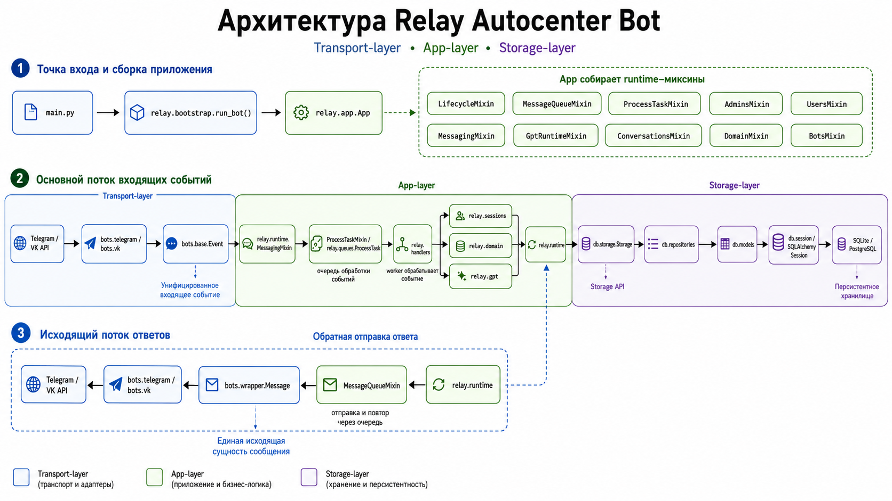
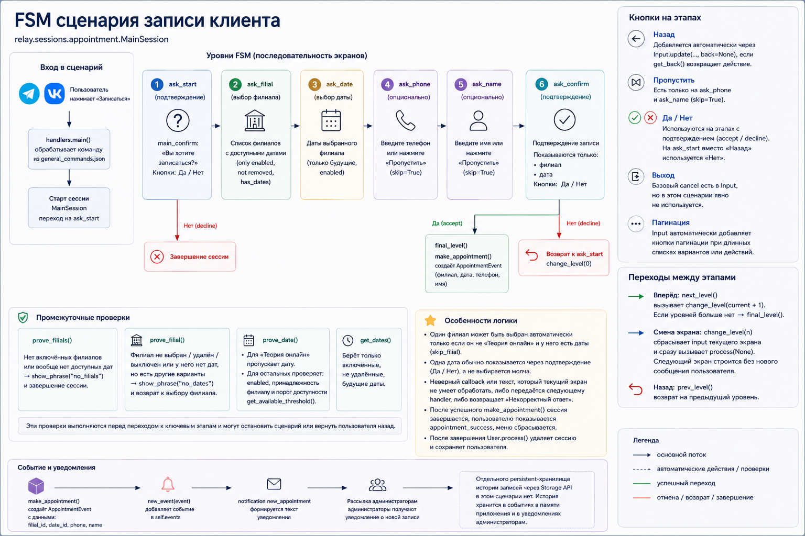

# Bots


Python-проект чат-бота для автошколы с поддержкой Telegram и VK, административными сценариями, записью клиентов, GPT-ответами и SQL-хранилищем.

Модульная архитектура: единый transport-layer для разных соцсетей, app-layer со state-machine сессиями, очереди задач, GPT-интеграцию, storage-layer на SQLAlchemy.

## Какую задачу решает

Автошколе нужен бот, который:

- отвечает клиентам в Telegram и VK через единые сценарии;
- помогает записаться на занятие без ручной переписки;
- позволяет администратору общаться с клиентом прямо через бота;
- даёт настраиваемые GPT-ответы с лимитами, контекстами и вопросами;
- сохраняет состояние пользователей, сессий, диалогов, сообщений и настроек.

Главная идея проекта — отделить бизнес-сценарии от конкретного API Telegram/VK, чтобы новые платформы можно было добавлять без переписывания app-layer.

## Возможности

- Единый интерфейс для Telegram и VK через пакет `bots`.
- Общая модель `Message`, `Event`, `Keyboard`, `Button`, `Attachment`.
- Wrapper-сообщения, которые умеют отправляться, редактироваться и удаляться как единая сущность, даже если в разных соцсетях сообщение разбивается по-разному.
- Пользовательские сессии: главное меню, запись на занятие, выбор филиала и даты.
- Административные сессии: пользователи, администраторы, уведомления, права, управление ботами, филиалы, даты.
- GPT-настройки из бота: провайдеры, модели, системные контексты, вопросы, лимиты токенов.
- Очереди сообщений и фоновых задач для управляемой обработки событий.
- SQL-хранилище через SQLAlchemy и миграции Alembic.
- Docker Compose с PostgreSQL и Docker secrets.
- Логирование событий приложения в файл и консоль.
- Unit-тесты для transport-layer, storage-layer, callback-ов, меню, сессий, GPT и очередей.

## Технологии

- `Python` — основной язык проекта.
- `pyTelegramBotAPI` / `telebot` — интеграция с Telegram Bot API.
- `vk_api` — интеграция с VK Long Poll и VK messages API.
- `SQLAlchemy` — ORM, модели и репозитории хранилища.
- `Alembic` — миграции схемы базы данных.
- `OpenAI-compatible API` — GPT-запросы через совместимый клиент.
- `tiktoken` — подсчёт токенов для GPT-контекстов и лимитов.
- `python-dotenv` — безопасная локальная конфигурация через `.env`.
- `Docker` и `Docker Compose` — контейнеризация приложения и PostgreSQL.
- `unittest`.
- `logging`.

## Что стоит посмотреть в первую очередь: 
- `bots/` — transport-layer: единая модель `Message`, `Event`, `Keyboard`, `Button`, `Attachment` для Telegram и VK.
- `relay/` — app-layer: обработчики, state-machine сессий, пользовательские и административные сценарии.
- `db/` — storage-layer: SQLAlchemy, Alembic, репозитории и единый Storage API.
- `tests/` — unit-тесты transport-layer, storage-layer, callback-ов, меню, сессий, GPT и очередей.
- `.github/workflows/ci.yml` — CI: compile, import sanity check, Alembic migrations и запуск `unittest`.

## Быстрый старт

### 1. Клонировать репозиторий

```bash
git clone https://github.com/teodoroven/Bots
cd Bots
```

### 2. Создать виртуальное окружение

Windows:

```powershell
py -m venv .venv
.\.venv\Scripts\Activate.ps1
```

Linux/macOS:

```bash
python3 -m venv .venv
source .venv/bin/activate
```

### 3. Установить зависимости

```bash
python -m pip install --upgrade pip
python -m pip install -r requirements.txt
```

### 4. Создать `.env`

```bash
cp .env.example .env
```

В Windows PowerShell:

```powershell
Copy-Item .env.example .env
```

Для локального запуска можно оставить SQLite:

```env
STORAGE_BACKEND=sql
DATABASE_URL=sqlite:///autocenter_bot.db
DATABASE_ECHO=0
```

### 5. Подготовить базу данных

```bash
alembic upgrade head
```

### 6. Проверить инфраструктуру без реальных ботов

Эти команды проверяют импорт, подключение к базе, миграции и unit-тесты. Они не запускают polling и не требуют реальных Telegram/VK/GPT-секретов.

```bash
python -c "import main; import relay; import db.storage"
alembic upgrade head
python -m unittest discover tests -p "*_test.py"
```

### 7. Запустить с реальными Telegram/VK ботами

Для реального запуска нужны сохранённые настройки ботов в storage: `bot_configs` с `bot_key`, `token`, `name` и `group_id`. Их можно добавить через интерактивное меню при первом запуске приложения или напрямую через storage.

`python main.py --check-startup` проверяет startup-конфигурацию без polling, но ожидает уже настроенные конфигурации ботов. Если боты ещё не добавлены, команда завершится ошибкой — это нормально для пустой локальной базы.

API-ключ GPT настраивается через административное GPT-меню или storage и не нужен для инфраструктурной проверки выше.

```bash
python main.py --check-startup
python main.py
```

## Docker Compose

Перед запуском подготовьте `.env` и Docker secret для PostgreSQL:

```bash
cp .env.example .env
mkdir -p .secrets
printf '%s' '<your-postgres-password>' > .secrets/postgres_password
```

Запуск:

```bash
docker compose up -d db
docker compose run --rm bot alembic upgrade head
docker compose up -d bot
```

`docker-compose.yml` не хранит пароль напрямую: PostgreSQL получает его из `.secrets/postgres_password`.

## Архитектура



Проект разделён на transport-layer, app-layer и storage-layer. Transport-layer скрывает различия Telegram/VK, app-layer обрабатывает сценарии, события, GPT и очереди, а storage-layer отвечает за SQL-хранилище, репозитории и миграции.

Основные зоны:

- `bots` — transport-layer, который приводит Telegram и VK к общей модели событий, сообщений, кнопок, клавиатур и вложений.
- `relay` — app-layer с обработчиками, сессиями, доменной моделью, GPT, уведомлениями и runtime-миксинами.
- `db` — storage-layer на SQLAlchemy: ORM-модели, репозитории, миграции и единый `Storage` API.
- `docs` — дополнительная документация по базе данных и эксплуатационным сценариям.

Подробные схемы жизненного цикла сообщения, сценария записи и storage-layer находятся в [docs/architecture.md](docs/architecture.md).

Подробности по слоям:

- [bots/README.md](bots/README.md)
- [relay/README.md](relay/README.md)
- [db/README.md](db/README.md)
- [docs/database.md](docs/database.md)

## Особенности

- Бизнес-логика не зависит напрямую от `telebot` и `vk_api`.
- Один сценарий меню работает в разных соцсетях, несмотря на разные правила callback-ов и редактирования сообщений.
- Сессии хранят состояние пользовательских и административных сценариев, а `Context` ограничивает доступ обработчиков к нужным зависимостям.
- GPT-настройки вынесены в доменную модель и управляются прямо из бота.
- Хранилище отделено от app-layer через репозитории и `Storage` API.
- Очереди сообщений и задач позволяют контролировать side effects: отправку, обработку, завершение и ошибки.

## Сценарий записи клиента



Запись клиента реализована как state-machine: пользователь проходит подтверждение, выбор филиала, выбор даты, ввод контактных данных и финальное подтверждение. После успешной записи приложение создаёт событие и уведомляет администратора.

## Тесты

Публичный unit-test набор:

```bash
python -m unittest discover tests -p "*_test.py"
```

Что покрывают тесты:

- transport-layer: Telegram/VK сообщения, кнопки, клавиатуры, вложения, wrapper-сообщения;
- storage-layer: SQLAlchemy storage и репозитории;
- app-layer: callback data, handlers, sessions, меню, users, GPT, queues, notifications.

## Что важно:
В проекте есть несколько зон повышенного риска:
- разные платформы Telegram/VK должны приводиться к общей модели событий
- callback-и и меню должны корректно восстанавливать состояние пользователя
- пользовательские и административные сессии не должны конфликтовать
- сообщения могут отправляться, редактироваться и удаляться по-разному на разных платформах
- очереди задач должны обрабатывать side effects управляемо
- GPT-ответы ограничиваются контекстами, моделями и лимитами
- storage-layer должен сохранять пользователей, сессии, события, настройки и историю. 

Проект включает задачи:
- тестирование state-machine сценариев
- проверка callback-протоколов
- тестирование транспортных адаптеров
- изоляция внешних API через общий интерфейс
- unit-тесты для бизнес-логики и инфраструктурных слоёв
- миграции БД как часть CI
- проверка импортов, компиляции и тестов в pipeline.

## Мой вклад

В рамках проекта реализованы:

- общий transport-layer для Telegram и VK;
- wrapper-сообщения, которые скрывают различия отправки, редактирования и удаления;
- state-machine пользовательских и административных сессий;
- сценарии записи клиента и связи с администратором;
- GPT-интеграция с контекстами, вопросами, моделями и лимитами;
- runtime-миксины app-layer по зонам ответственности;
- SQLAlchemy/Alembic storage-layer;
- очереди сообщений и фоновых задач.

## Лицензия

Проект распространяется по лицензии [MIT](LICENSE).
