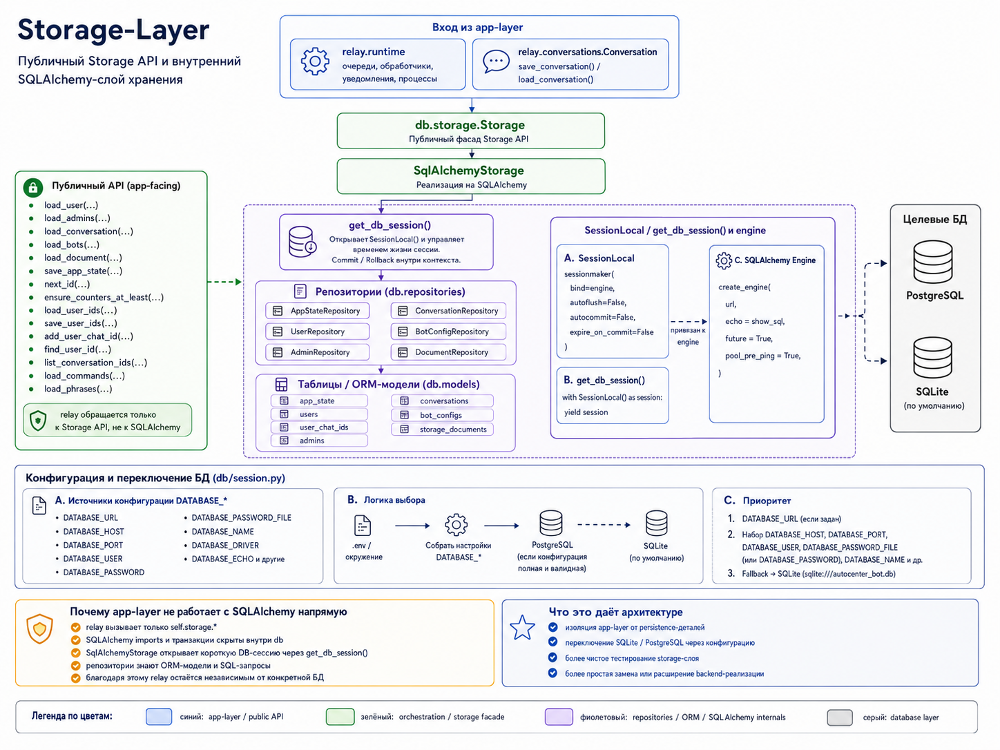

# db

Storage-layer проекта.

Пакет `db` отвечает за хранение состояния приложения: пользователей, администраторов, диалогов, конфигураций ботов, очередей и JSON-документов доменной модели. App-layer не работает с SQLAlchemy напрямую, а обращается к storage API и репозиториям.

## Назначение

`db` отделяет persistence-логику от сценариев бота.

Слой решает несколько задач:

- хранит состояние;
- даёт единый `Storage` API для runtime-логики;
- инкапсулирует SQLAlchemy ORM-модели;
- поддерживает SQLite для локального запуска;
- поддерживает PostgreSQL для Docker/server окружения;
- управляет схемой через Alembic.

## Архитектура пакета

```text
relay.runtime
     ↓
db.storage.Storage
     ↓
db.repositories
     ↓
db.models
     ↓
SQLAlchemy Session
     ↓
SQLite / PostgreSQL
```



App-layer работает только с публичным `Storage API`. SQLAlchemy-сессии, engine, ORM-модели и репозитории остаются внутри слоя `db`.

Основные части:

- `db.models` — ORM-модели таблиц: глобальное состояние, пользователи, chat id, администраторы, диалоги, bot configs, storage documents.
- `db.repositories` — репозитории для чтения и записи конкретных групп сущностей.
- `db.storage` — абстрактный `Storage` и SQLAlchemy-реализация `SqlAlchemyStorage`.
- `db.session` — создание database URL, engine и `Session`.

## Локальный запуск

Для разработки достаточно SQLite:

```env
STORAGE_BACKEND=sql
DATABASE_URL=sqlite:///autocenter_bot.db
DATABASE_ECHO=0
```

Применение миграций:

```bash
alembic upgrade head
```

## PostgreSQL и Docker

Для Docker/server окружения можно использовать отдельные поля подключения:

```env
DATABASE_URL=
DATABASE_DRIVER=postgresql+psycopg
DATABASE_HOST=db
DATABASE_PORT=5432
DATABASE_NAME=autocenter_bot
DATABASE_USER=bot_user
DATABASE_PASSWORD_FILE=/run/secrets/postgres_password
DATABASE_ECHO=0
STORAGE_BACKEND=sql
```

Пароль PostgreSQL хранится в Docker secret, а не в `docker-compose.yml`.

## Тесты

Публичные storage-тесты находятся в `tests/db` и запускаются общей командой:

```bash
python -m unittest discover tests -p "*_test.py"
```
