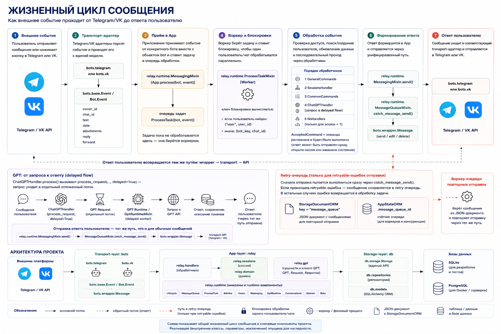

# Архитектура проекта

Этот документ содержит подробные схемы архитектуры Relay Autocenter Bot: общую структуру слоёв, жизненный цикл сообщения, FSM сценария записи клиента и storage-layer.

## Общая архитектура

Схема показывает точку входа `main.py`, запуск через `relay.bootstrap`, сборку `relay.app.App`, runtime-миксины, transport-layer, app-layer и storage-layer.

## Жизненный цикл сообщения

Схема показывает путь входящего события от Telegram/VK до ответа пользователю: транспортный адаптер, унифицированный `Event`, очередь обработки, блокировки, handlers, sessions, GPT delayed flow, retry-очередь и отправка ответа через wrapper-сообщение.

## FSM сценария записи клиента

Схема описывает state-machine записи клиента: старт, выбор филиала, выбор даты, ввод телефона, ввод имени, подтверждение, создание записи и уведомление администратора.

## Storage-layer

Схема показывает публичный `Storage API`, реализацию `SqlAlchemyStorage`, репозитории, ORM-модели, SQLAlchemy session/engine, Alembic-миграции и целевые базы SQLite/PostgreSQL.
